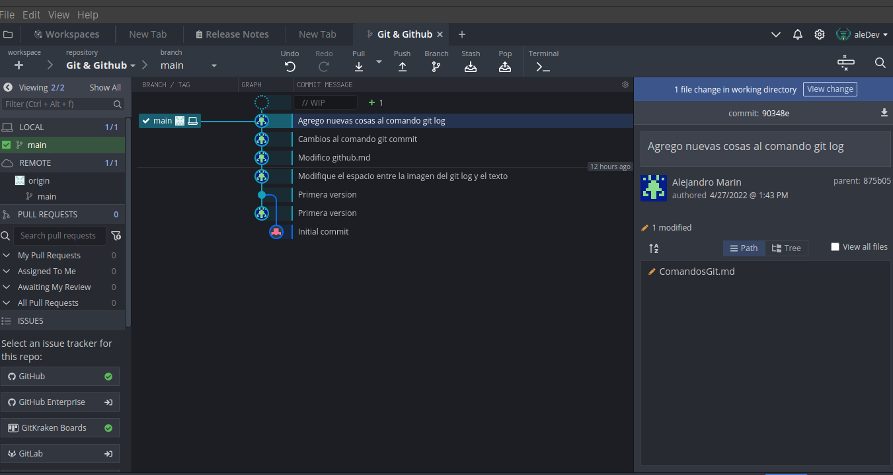
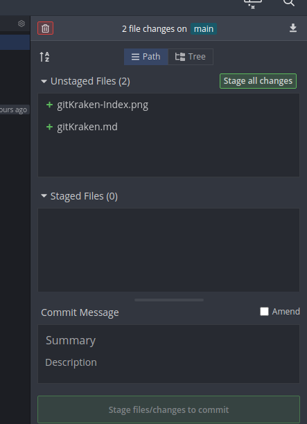

## Como usar Git Kraken

Para iniciar un repositorio solo vamos a file -> Open Repo, y luego elegimos el repositorio y nos saldrá una ventana como esta:

Que nos muestra todos los commits hecho por quien y a que archivos afecto ese commit.

Si hacemos cambios a nuestro repositorio, veremos algo como esto:

Esto nos muestra los archivos modificados en el repositorio, y podemos agregar todos los archivos modificados con la opcion **Stage all changes** como un **git add .** o agregarlos uno por uno que sería moover el mouse sobre el archivo y saltará la opcion de **Stage file**, que seria como un git add nombreArchivo.extension, luego abajo ponemos el mensaje que va con ese commit y le damos a **Stage files/changes to commit**.
