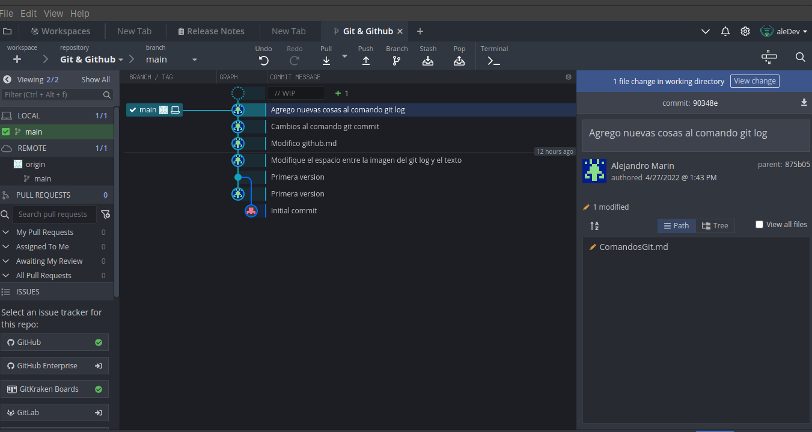
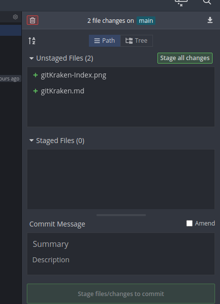

# Que es GitKraken

GitKraken es una GUI para tener de manera visual y mas bonita nuestros commits en nuestro proyecto. [Página de descarga](https://www.gitkraken.com/)

## Como usar GitKraken

Para ver un repositorio solo vamos a **file** -> **Open Repo**, y luego elegimos el repositorio y nos saldrá una ventana como esta:

Nos muestra todos los commits hechos, por quien y a que archivos afecto ese commit.

### Que ocurre si hicimos un cambio a nuestro repositorio

Si hacemos cambios a nuestro repositorio (esto desde la terminal) veremos algo como esto:

Esto nos muestra los archivos modificados en el repositorio, y podemos agregar todos los archivos modificados con la opcion **Stage all changes** que sería como un **git add .** o agregarlos uno por uno que sería moover el cursor sobre el archivo y saltará la opcion de **Stage file** que sería como un **git add nombreArchivo.extension**, luego abajo en **Commit Message** ponemos el mensaje que va con ese commit y le damos a **Stage files/changes to commit**.

### Ver cambios que hicimos en un commit

Si queremos ver los cambios que se hicieron a un archivo en especifico en ese commit, solamente dandole click al commit y luego al archivo ya nos mostrará que se agregó.
