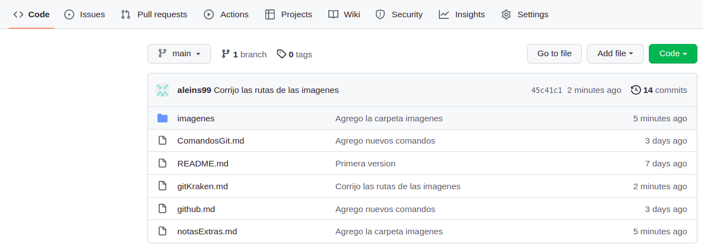
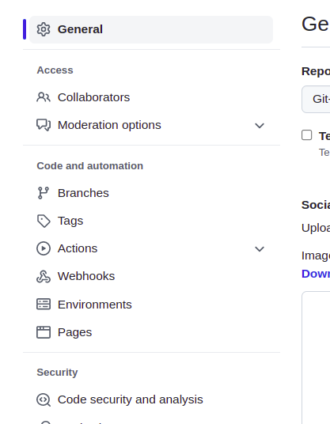
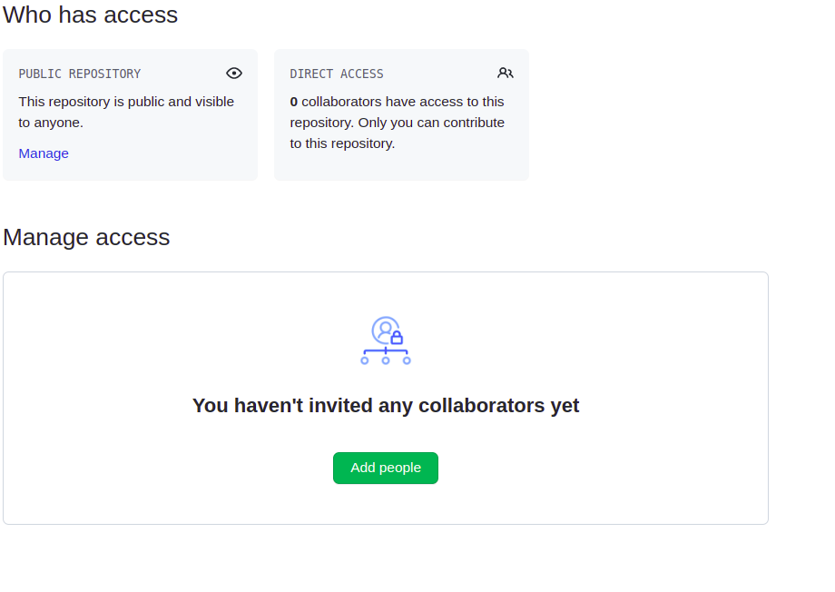

# Comandos Git para Github

## git remote add origin main **clave sacada de github https**

## git push origin main

Git envia a Github la rama main. Coloca en github todo lo que tenemos en nuestra rama main.

## git pull origin main

Esto nos trae todo lo que tenemos en github en ese repositorio a la rama main.

## Como crear una llave ssh

**ssh-keygen -t rsa -b 4096 -C "correoelectronicodegithub"**

Esto nos generará dos llaves, una publica y otra privada y lo genera en una carpeta oculta **.ssh** en el directorio donde llamamos al comando.

## .gitignore

Creamos un archivo con este nombre **.gitignore** y este archivo nos sirve para colocar todos los archivos, carpetas etc que no queremos que se agreguen a nuestro repositorio. Por ej: un node modules un archivo con contraseñas, etc.

Una pagina que nos ayuda a saber que hay que ignorar con respecto al lenguaje [Link](https://toptal.com/developers/gitignore).

Ej de como agregar archivos y carpetas en git ignore.

- **.DS_Store** un archivo en especial llamado DS_STORE

- **nombreCarpeta/** las carpetas se agregan con / al final

- **\*.log** archivos con extension .log

- **nombrearchivo.extension** un archivo en especifico

❗Si hacemos un commit estos archivos, carpetas no se van a agregar al repositorio.

## Como trabajar con colaboradores

**Pasos para agregar colaboradores a nuestro proyecto**

Settings  👉 Parte izquierda, collaborators 👉 Y finalmente add people  Ponemos su correo o su usuario de github para agregarlo.
